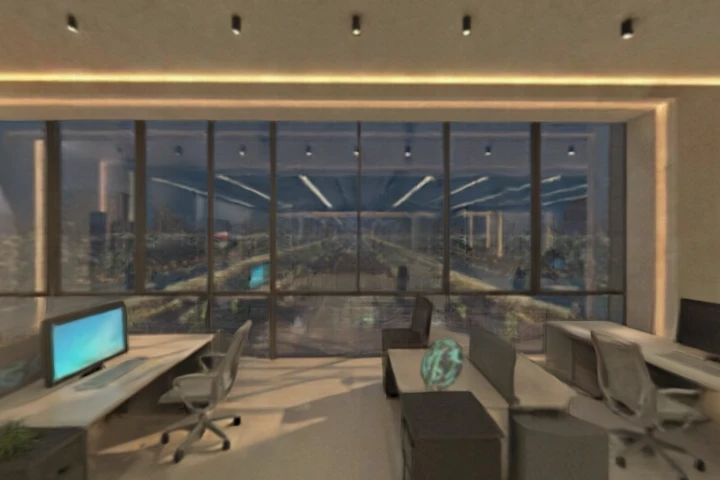

<h1 align="center">🌍 World Labs Toolkit — 3D as Code</h1>

<p align="center">
  <b>Generate persistent, explorable 3D worlds from a line of text or a single photo — programmatically.</b>
</p>

<p align="center">
  
  
  
  
  
</p>

<p align="center">
  
</p>
<p align="center"><sub>👆 <i>"A cozy futuristic startup office, plants, warm light, city view"</i> — one prompt, one explorable 3D world. <a href="https://marble.worldlabs.ai/world/2c86dc39-f177-4f95-8894-dbc99389bc4b">Walk it →</a></sub></p>

---

> **Text became the universal interface for software. 3D is becoming it for space.**

A world stops being a throwaway render and becomes a **structured, versionable artifact** you can generate, inspect, export, and reuse — a mesh for Blender, Gaussian splats for the web, a panorama, a walkable URL. That's the **3D-as-code** idea from [World Labs](https://www.worldlabs.ai/blog/3d-as-code), packaged here as a zero-dependency helper + an agent skill.

## Why it's different

| Image/video generators | **This toolkit** |
|---|---|
| Output a flat frame | Output an **explorable 3D world** |
| Throwaway pixels | **Persistent, exportable artifact** (GLB, splats, pano) |
| Can't edit the space | Re-generate from tweaked intent — like recompiling |
| Heavy SDKs | **Pure Python stdlib**, one file |

## What's inside

```
scripts/marble.py        zero-dep client: text→world · image→world · poll · download
skills/3d-as-code/       an agent SKILL.md (Claude Code / Cursor / any MCP-style agent)
test-data/cozy-office/   a real generated world: thumbnail + mesh.glb + splats + metadata
```

## Quick start

```bash
# free key + credits at platform.worldlabs.ai
export WORLDLABS_API_KEY=...

# text → world, wait for it, download all assets
python scripts/marble.py text "A mystical forest with glowing mushrooms" --name Forest --wait --out worlds/forest

# the headline move — a PHOTO becomes a navigable 3D space
python scripts/marble.py image https://example.com/livingroom.jpg --name Room --wait --out worlds/room
```

You get `mesh.glb` (Blender/Unity/Unreal), `splat_*.spz` (web/VR), `panorama.jpg`, and a `marble_url` to walk the world in the browser.

## Commands

| Command | Does |
|---|---|
| `text "<prompt>"` | text → 3D world |
| `image <url> [--prompt …] [--pano]` | image → 3D world |
| `poll <operation_id>` | status, progress, credit cost |
| `get <world_id>` | world record + asset URLs |
| `download <id> --out <dir>` | grab thumbnail + mesh + splats + metadata |

Add `--wait --out <dir>` to generate, block until done, and download in one shot.

## The exports

- **`mesh.glb`** — geometry + collider, drops straight into Blender / Unity / Unreal
- **Gaussian splats** (`.spz`, 100k → full-res) — photoreal, web-navigable
- **360° panorama** — equirectangular still
- **marble_url** — explore the world in the browser

## ⚠️ Read before you ship

- 💳 **Paid beyond free credits.** A world ≈ 1500 credits + ~80 for the panorama. Generate deliberately.
- ⏳ **Asset URLs expire** (limited TTL). The world stays on your Marble account, but the direct download links die within hours — **download right after generating**.
- 🖼️ **`image → world` needs a public image URL** (jpg/png/webp). Host the image somewhere reachable first.

## Combos

- **Blender** → import `mesh.glb`, light it, render or animate a fly-through.
- **HyperFrames** → use a world panorama/render as a launch-video backdrop.
- **Concept-art loop** → generate an image (any image model), host it, then `image → world`.

## Credits & links

Built on **[World Labs](https://www.worldlabs.ai)** Marble. Concept: [3D as Code](https://www.worldlabs.ai/blog/3d-as-code) · vision: [Building Spatial Intelligence](https://radical.vc/building-spatial-intelligence-how-world-labs-is-creating-the-next-frontier-in-ai/).

> Independent open-source toolkit. Not affiliated with or endorsed by World Labs. "Marble" and "World Labs" are trademarks of their owners.

## License

MIT.
